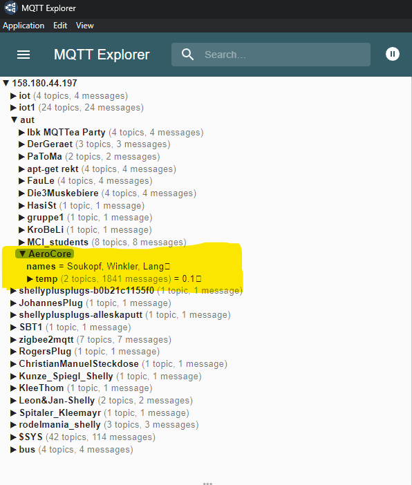
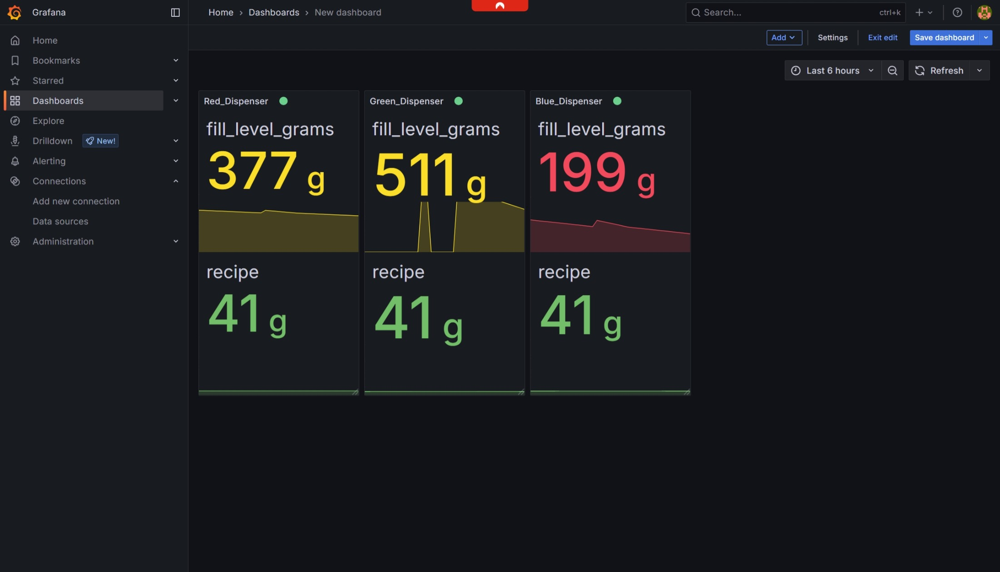
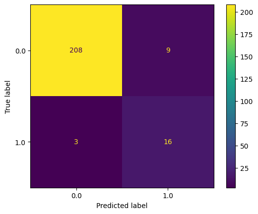

# 🚀 **MCI BA-MECH-2023 Automatisierungstechnik**

---

# 🤖 Machine Learning Extension

---

## 📋 Table of Contents
- [Team](#team)
- [Tasks](#tasks)
- [Linear Regression](#linear-regression)
- [Classification](#classification)
- [Visualizations](#visualizations)

---

## 👥 Team
| Name                | Semester |
|---------------------|----------|
| Nikolaus Soukopf    | 4        |
| Philipp Winkler     | 4        |
| Andreas Lang        | 4        |

---

## ✅ Tasks

| Aufgabe         | Details                                                                                           | Status |
|-----------------|---------------------------------------------------------------------------------------------------|:------:|
| **12.1.1 (20%)**| Wird korrekt übertragen.                                                                      | ✔️     |

<figure>
  
  <figcaption align="center"><b>Abbildung:</b> MQTT Übertragung</figcaption>
</figure>

| **12.1.2 (40%)**| Alle Topics werden als TinyDB abgespeichert. `report_generator.py` visualisiert im definierten Zeitraum (siehe `config.py`). Plots laufen in Grafana . Bei Verbindungsabbruch: reconnect bis wieder verbunden. | ✔️     |
| **12.3 (20%)**  | Siehe unten                                                                                       | ✔️     |
| **12.4 (20%)**  | Siehe unten                                                                                       | ✔️     |

---

## 📈 Linear Regression

| Genutzte Spalten | Modell-Typ | MSE (Train) | MSE (Test) |
|------------------|------------|-------------|------------|
| vibration_index_red, fill_level_grams_red, vibration_index_blue, fill_level_grams_blue, vibration_index_green, fill_level_grams_green, temperature_green, temperature_red, temperature_blue | Linear | 5.86e-29 | 7.17e-29 |

**Lineares Regressionsmodell:**
```math
y = (0.1000)\cdot vibration\_index\_red + (0.0005)\cdot fill\_level\_grams\_red + (0.1000)\cdot vibration\_index\_blue + (0.0005)\cdot fill\_level\_grams\_blue + (0.1000)\cdot vibration\_index\_green + (0.0005)\cdot fill\_level\_grams\_green + (0.2000)\cdot temperature\_green + (0.2000)\cdot temperature\_red + (0.2000)\cdot temperature\_blue - 15.0000
```

> **Prognose des X-Datensetz unter:**
> [`maschine_learning/reg_`](maschine_learning/reg_)

---

## 🧠 Classification

| Genutzte Features | Modell-Typ | F1-Score (Train) | F1-Score (Test) |
|-------------------|------------|------------------|-----------------|
| mean(), std(), min(), max() | Log. Regression | 0.95 | 0.90 |

---

## 🖼️ Visualizations

<figure>
  
  <figcaption><b>Abbildung:</b> Confusion Matrix der Klassifikation</figcaption>
</figure>

---

> *Letzte Aktualisierung: 18. Juni 2025*